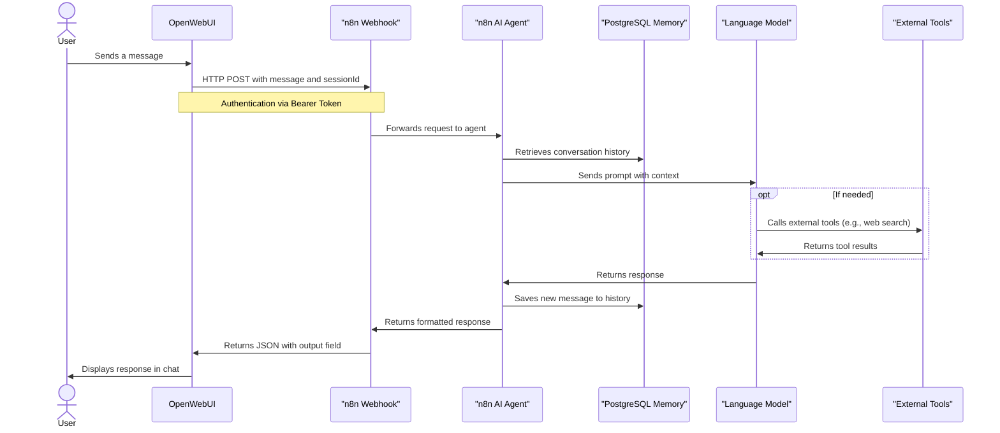
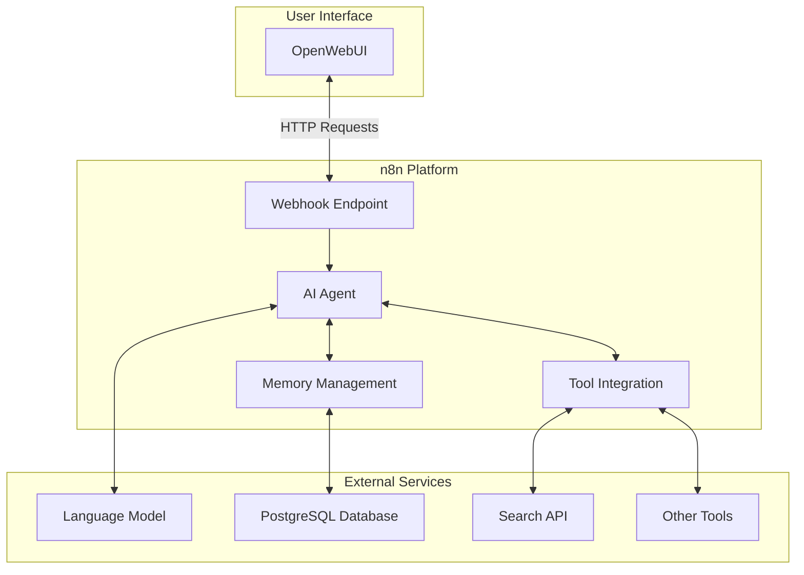
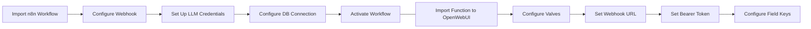

# Integration Workflow Diagram

The following diagram illustrates the integration flow between OpenWebUI and n8n:

## System Architecture

## Function Setup Flow

These diagrams help visualize how the different components of the integration work together and the setup process.
